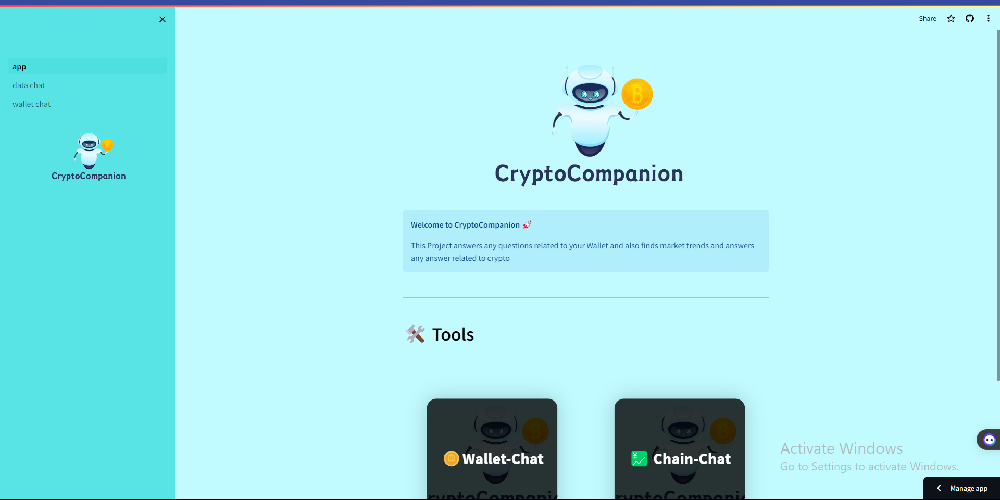
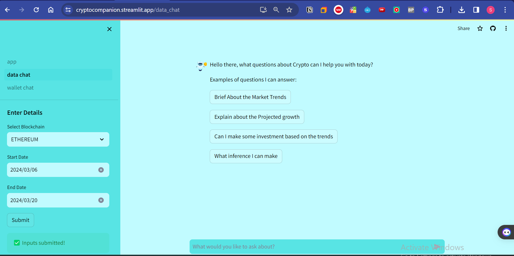
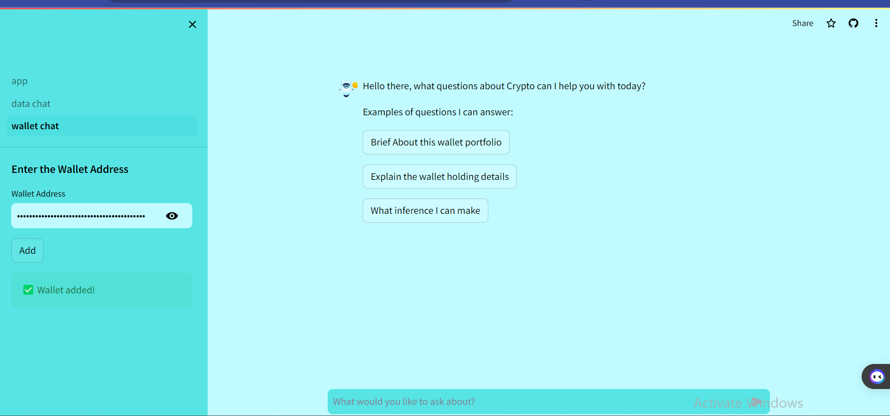
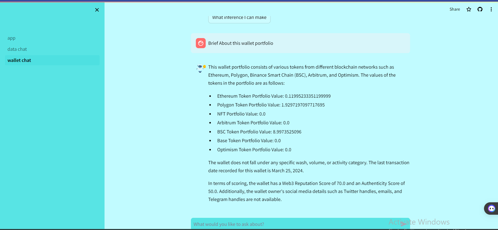
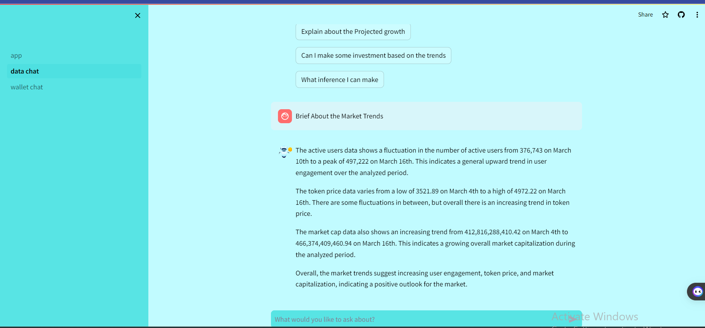
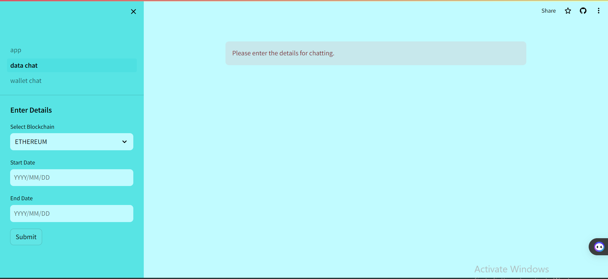
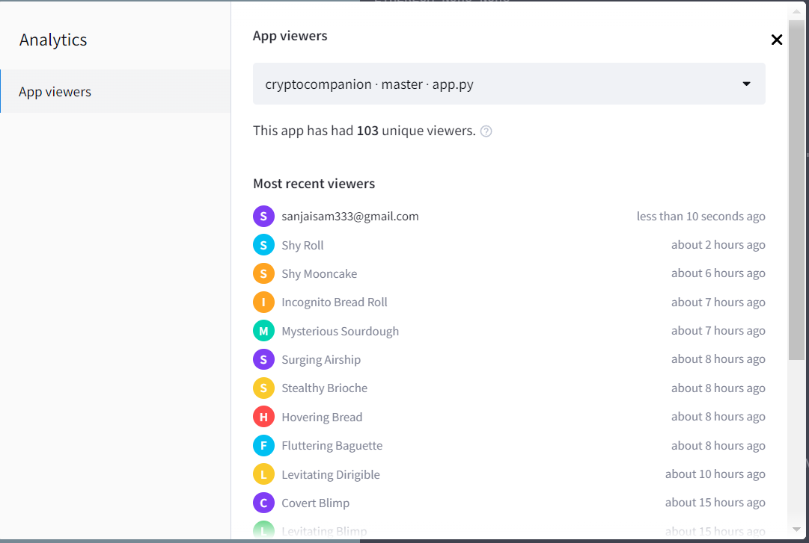

### Team Name : 
**Techiee Hackers**

1) Sanjai L 
2) Abinaya S

### Problem
The Problem the most of them face when their starting crypto investment
the most of them are not a Technical person even when I started
there lot of terms and metrics are involved analysing the crypto world
on your knowledge is tough as a Beginner every one need not be a **Crypto Genius**

### Solution
So we thought of solving this problem thats when this idea striked 💡 Companion to analyse the current trend of market
and doing a analyses for you making the recomendation for you and giving some suggestion to help you 
and make you comfortable with crypto  and helping you in the journey of becoming the **Crypto Genius**

### What it Does?

As of now we have two tools to explore

1) #### Chain Chat : 
   Where you can ask any question about the chain, 
   this LLM has realtime data of market this is powered by **Blaze Data API**
   this feature helps you analyses the market trends , providing insights about market
   giving suggestion etc

2) #### Wallet Chat :
   This Tool help you analses your wallet address or any other wallet address you required to get insights
   get some suggestion of your wallet holding or to get any
   recomendation for you based on some others wallet address etc
      

   
   

### [Live Aplication  -🌐](https://cryptocompanion.streamlit.app/)

### Installation Instruction

1) Clone the repo
> git clone   https://github.com/sanjail3/CryptoCompanion.git

2) Create a Virtual Environment
> python -m venv crypto-companion

3) Install all the requirements
> pip install -r requirements.txt

4) Create a .env file and store the api key
>OPENAI_API_KEY= 

> BLAZEAI_API_KEY=

5) Run the App
>streamlit run app.py

### Demo Video

#### [Watch the Demo Video](https://youtu.be/V4G5L12qswc)

#### Usage Instruction

##### 1) For Wallet-Chat you have to enter the wallet address for start chating

#### 2) For Chain-Chat you have to sellect the chain and start date and end data for start chating

### Additional Note

 Our APP is started to get attraction where we gained nearly **100** users 🚀🚀 within short time
purely from organic growth where we pitched our product to lot of web3 communites
and got good feedbacks trying to improve based on their suggestions

### Future Enhacnement 
Trying improve our user experience adding more features
improving the LLM with more data from different sources improving the result it produce

