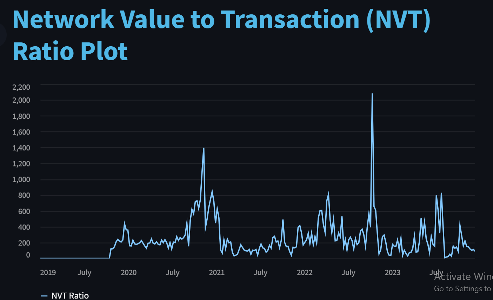
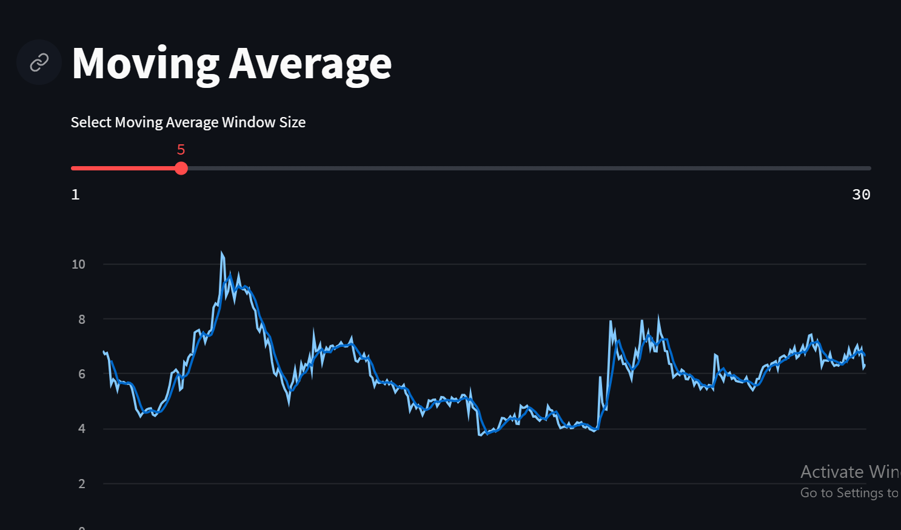
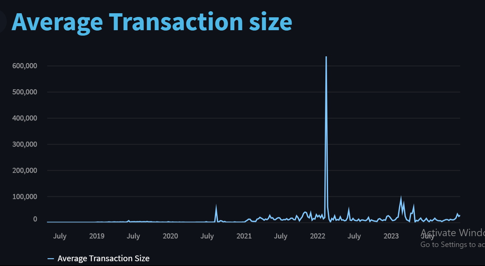
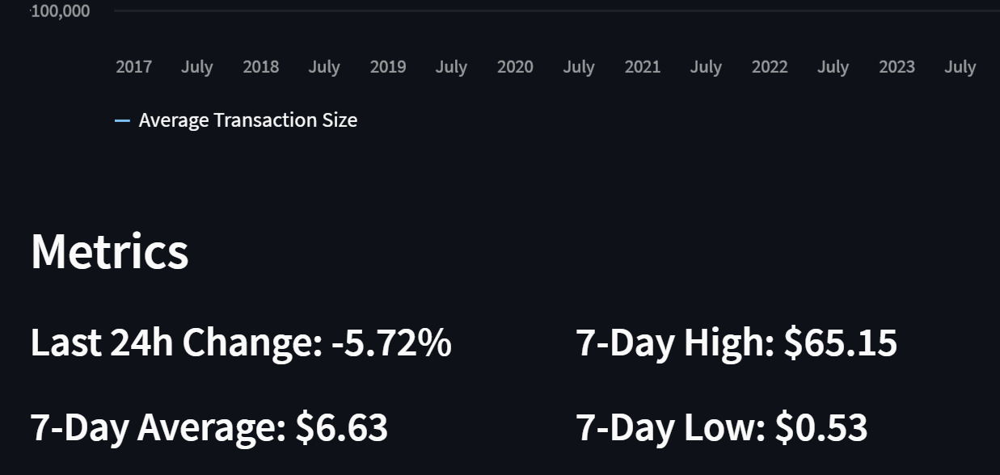
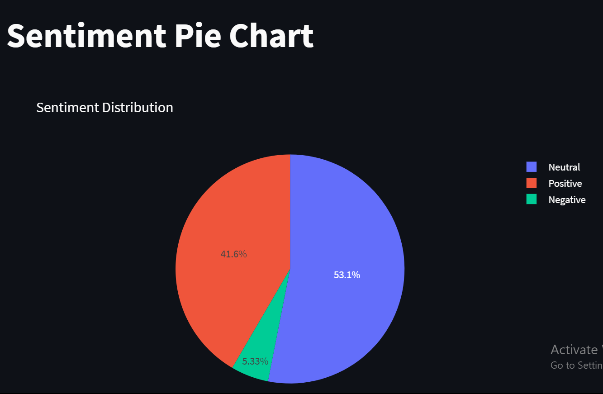

# Token Assigned is LPT:

### Sample Analysis:

### We Have Analysed All the Factors:

1.**Technical Analysis**

2.**OnChain Analysis**

3.**Sentimental Analysis**

4.**Fundamental Analysis**

5.**Tokenomics**

We Have Gathered all the Insights  of LPT token

## To Check our Application:

1.Download This Directory

2.Install all the requirements
   >pip install -r requirements.txt 

3.Run the Application
   >python run app.py

## Vote
>**If You found Our Analysis is Valuable ,got some insights and learned something new Vote For Us**

## Team -Techiee Hackers:
   1. **Sanjai**
   2. **Abinaya**